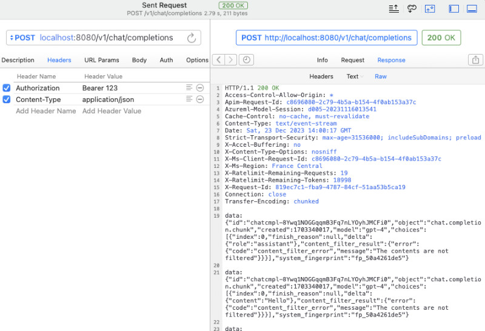

# Amazing OpenAI API

Convert different model APIs into the OpenAI API format out of the box.

能够将各种不同的模型 API 转换为开箱即用的 OpenAI API 格式。

当前支持模型：

- Azure OpenAI API
- YI 34B API
- Google Gemini Pro

## 配置

应用配置：

```bash
# 选择一个服务, "azure", "yi", "gemini"
AOA_TYPE: "azure"
# 不同的服务，进行不同的细节配置
# ...
```

可选配置：

```bash
# 服务端口，默认 `8080`
AOA_PORT: 8080
# 服务地址，默认 `0.0.0.0`
AOA_HOST: "0.0.0.0"
```

## Azure 使用

如果我们想将 Azure 上部署的 OpenAI 服务转换为标准的 OpenAI 调用，可以用下面的命令：

```bash
AZURE_ENDPOINT=https://<你的 Endpoint 地址>.openai.azure.com/ AZURE_API_KEY=<你的 API KEY> AZURE_MODEL_ALIAS=gpt-3.5-turbo:gpt-35 ./amazing-openai-api 
```

在上面的命令中 `AZURE_ENDPOINT` 和 `AZURE_API_KEY` 包含了 Azure OpenAI 服务中的核心要素，因为 Azure 部署 GPT 3.5 / GPT 4 的部署名称不允许包含 `.`，所以我们使用 `AZURE_MODEL_ALIAS` 将我们**请求内容中的模型名称**替换为真实的 Azure 部署名称。甚至可以使用这个技巧将各种开源、闭源软件使用的模型自动映射为我们希望的模型：

```bash
# 比如不论是 3.5 还是 4 都映射为 `gpt-35`
AZURE_MODEL_ALIAS=gpt-3.5-turbo:gpt-35,gpt-4:gpt-35
```

因为我们已经配置了 `AZURE_API_KEY`，所以开源软件也好，使用 `curl` 调用也罢，都不需要添加 `Authorization: Bearer <你的 API Key>` （也可以随便写），这样就起到了严格的 API Key 隔离，提升了 API Key 的安全性。



如果你还是习惯在请求头参数中添加认证内容，可以使用下面的不包含 `AZURE_API_KEY` 的命令，程序将透传验证到 Azure 服务：

```bash
AZURE_ENDPOINT=https://<你的 Endpoint 地址>.openai.azure.com/ AZURE_MODEL_ALIAS=gpt-3.5-turbo:gpt-35 ./amazing-openai-api 
```

### 模型参数设置

```bash
# (必选) Azure Deployment Endpoint URL
AZURE_ENDPOINT
# (必选) Azure API Key
AZURE_API_KEY
# (可选) 模型名称，默认 GPT-4
AZURE_MODEL
# (可选) API Version
AZURE_API_VER
# (可选) 模型映射别名
AZURE_MODEL_ALIAS
# (可选) Azure 网络代理
AZURE_HTTP_PROXY
AZURE_SOCKS_PROXY
```

## YI (零一万物)

如果我们想将 YI 官方的 API 转换为标准的 OpenAI 调用，可以用下面的命令：

```bash
AOA_TYPE=yi YI_API_KEY=<你的 API KEY> ./amazing-openai-api 
```

和使用 Azure 服务类似，我们可以使用一个技巧将各种开源、闭源软件使用的模型自动映射为我们希望的模型：

```bash
# 比如不论是 3.5 还是 4 都映射为 `gpt-35`
YI_MODEL_ALIAS=gpt-3.5-turbo:yi-34b-chat,gpt-4:yi-34b-chat
```

如果我们在启动服务的时候配置了 `YI_API_KEY` 的话，不论是开源软件也好，使用 `curl` 调用也罢，我们都不需要添加 `Authorization: Bearer <你的 API Key>` （也可以随便写），这样就起到了严格的 API Key 隔离，提升了 API Key 的安全性。

如果你还是习惯在请求头参数中添加认证内容，可以使用下面的不包含 `YI_API_KEY` 的命令，程序将透传验证到 Yi API 服务：

```bash
./amazing-openai-api 
```

### 模型参数设置

```bash
# (必选) YI API Key
YI_API_KEY
# (可选) 模型名称，默认 yi-34b-chat
YI_MODEL
# (可选) YI Deployment Endpoint URL
YI_ENDPOINT
# (可选) API Version，默认 v1beta，可选 v1
YI_API_VER
# (可选) 模型映射别名
YI_MODEL_ALIAS
# (可选) Azure 网络代理
YI_HTTP_PROXY
YI_SOCKS_PROXY
```

## Gemini PRO

如果我们想将 Google 官方的 Gemini API 转换为标准的 OpenAI 调用，可以用下面的命令：

```bash
AOA_TYPE=gemini GEMINI_API_KEY=<你的 API KEY> ./amazing-openai-api 
```

和使用 Azure 服务类似，我们可以使用一个技巧将各种开源、闭源软件使用的模型自动映射为我们希望的模型：

```bash
# 比如不论是 3.5 还是 4 都映射为 `gpt-35`
GEMINI_MODEL_ALIAS=gpt-3.5-turbo:gemini-pro,gpt-4:gemini-pro
```

如果我们在启动服务的时候配置了 `GEMINI_API_KEY` 的话，不论是开源软件也好，使用 `curl` 调用也罢，我们都不需要添加 `Authorization: Bearer <你的 API Key>` （也可以随便写），这样就起到了严格的 API Key 隔离，提升了 API Key 的安全性。

如果你还是习惯在请求头参数中添加认证内容，可以使用下面的不包含 `GEMINI_API_KEY` 的命令，程序将透传验证到 Google AI 服务：

```bash
./amazing-openai-api 
```